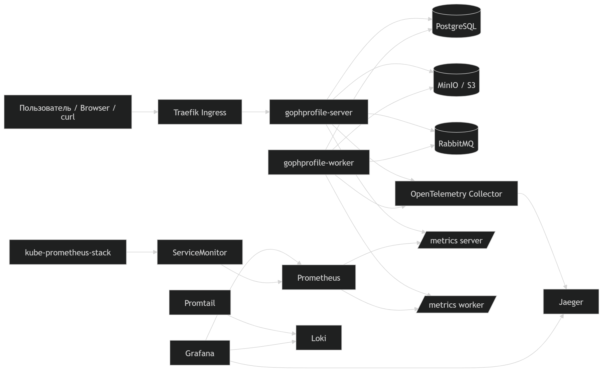

## Микросервис управления аватарками пользователя (Avatar Service)

### Назначение

- Сервис обеспечивает загрузку, хранение и обработку аватарок пользователей.
- Поддерживает установку главной аватарки, автоматическую генерацию миниатюр и асинхронное удаление для снижения нагрузки на основную БД.

### Архитектурная диаграмма

### Архитектура и ключевые решения

- **Двухэтапное сохранение** — при добавлении аватарки метаданные сразу пишутся в PostgreSQL, оригинал изображения сохраняется в S3.
- **Асинхронная обработка миниатюр** — после сохранения в очередь (Kafka / RabbitMQ, выбор в конфиге) отправляется событие на генерацию двух версий: 100×100 и 300×300.
- **Гибкая конфигурация брокера** — брокер сообщений выбирается через конфигурационный файл без изменения кода.
- **Асинхронное удаление** — удаление аватарки происходит через event-событие, что позволяет не нагружать БД синхронными операциями и гарантирует очистку всех связанных ресурсов (метаданные, оригинал, миниатюры).
- **Observability (наблюдаемость)**:
  - Метрики — сбор и агрегация через Prometheus
  - Логи — централизованный сбор через Loki с просмотром в Grafana
  - Трейсинг — распределённые трассировки через Jaeger
  - Корреляция сигналов — логи, метрики и трейсы связаны между собой через `trace_id` и бизнес-идентификаторы (`avatar_id`)
- **Kubernetes deployment**:
  - сервис развернут в Kubernetes
  - HTTP API опубликован через Ingress
  - для `server` и `worker` настроен HPA
  - сетевой доступ ограничен через `NetworkPolicy`
  - конфиденциальные данные вынесены в `Secret`
  - monitoring интегрирован через `ServiceMonitor`

### Инструкция по развёртыванию

#### Требования

- Для запуска проекта необходимы Docker, Rancher Desktop с включённым Kubernetes, `kubectl` и `helm`.
- Предполагается, что развёртывание выполняется в локальном Kubernetes-кластере Rancher Desktop.
- Ожидается, что активный Kubernetes-контекст — `rancher-desktop`.

#### Проверка окружения

Перед началом работы необходимо проверить окружение:

- `kubectl config current-context`
- `kubectl get nodes`
- `kubectl cluster-info`
- `helm version`
- `docker version`

#### Сборка Docker-образа

- Из корня проекта собирается Docker-образ приложения:
  - `docker build -t gophprofile-server:latest .`

- Собранный образ содержит оба бинаря приложения:
  - `gophprofile-server`
  - `gophprofile-worker`

#### Развёртывание в Kubernetes

##### Создание namespace

- Сначала создаётся namespace проекта:
  - `kubectl apply -f .\k8s\server\namespace.yaml`

##### Развёртывание базовых зависимостей

- После создания namespace поочерёдно разворачиваются базовые зависимости.

**PostgreSQL**
- `kubectl apply -f .\k8s\postgres\`

**MinIO**
- `kubectl apply -f .\k8s\minio\`

**RabbitMQ**
- `kubectl apply -f .\k8s\rabbitmq\`

- После этого рекомендуется проверить состояние pod’ов и сервисов:
  - `kubectl get pods -n gophprofile`
  - `kubectl get svc -n gophprofile`

##### Развёртывание observability-компонентов

- После запуска базовых зависимостей разворачиваются observability-компоненты.

**Jaeger**
- `kubectl apply -f .\k8s\jaeger\`

**OpenTelemetry Collector**
- `kubectl apply -f .\k8s\otel\`

**Prometheus**
- `kubectl apply -f .\k8s\prometheus\`

**Loki**
- `kubectl apply -f .\k8s\loki\`

**Grafana**
- `kubectl apply -f .\k8s\grafana\`

##### Развёртывание основных компонентов приложения

- Основные манифесты `server` применяются отдельно, без `servicemonitor.yaml`, так как namespace `monitoring` на этом этапе ещё не создан.

**server**
- `kubectl apply -f .\k8s\server\secret.yaml`
- `kubectl apply -f .\k8s\server\service.yaml`
- `kubectl apply -f .\k8s\server\deployment.yaml`
- `kubectl apply -f .\k8s\server\hpa.yaml`
- `kubectl apply -f .\k8s\server\ingress.yaml`
- `kubectl apply -f .\k8s\server\networkpolicy.yaml`

**worker**
- `kubectl apply -f .\k8s\worker\service.yaml`
- `kubectl apply -f .\k8s\worker\deployment.yaml`
- `kubectl apply -f .\k8s\worker\hpa.yaml`
- `kubectl apply -f .\k8s\worker\networkpolicy.yaml`

#### Установка Promtail

- Для сбора логов используется Helm chart `grafana/promtail`.

##### Подключение репозитория Helm

- `helm repo add grafana https://grafana.github.io/helm-charts`
- `helm repo update`

##### Установка Promtail

- `helm install promtail grafana/promtail -n gophprofile --set "config.clients[0].url=http://loki:3100/loki/api/v1/push"`

#### Установка kube-prometheus-stack

- Для поддержки `ServiceMonitor` используется `kube-prometheus-stack`.

##### Подключение репозитория Helm

- `helm repo add prometheus-community https://prometheus-community.github.io/helm-charts`
- `helm repo update`

##### Создание namespace monitoring

- `kubectl create namespace monitoring`

##### Установка стека мониторинга

- `helm install kube-prometheus-stack prometheus-community/kube-prometheus-stack -n monitoring`

##### Применение ServiceMonitor

- После создания namespace `monitoring` и установки `kube-prometheus-stack` применяются `ServiceMonitor` для `server` и `worker`:
  - `kubectl apply -f .\k8s\server\servicemonitor.yaml`
  - `kubectl apply -f .\k8s\worker\servicemonitor.yaml`

#### Проверка состояния кластера

- После завершения развёртывания выполняется проверка состояния кластера:
  - `kubectl get pods -n gophprofile`
  - `kubectl get svc -n gophprofile`
  - `kubectl get ingress -n gophprofile`
  - `kubectl get hpa -n gophprofile`
  - `kubectl get networkpolicy -n gophprofile`
  - `kubectl get servicemonitor -n monitoring`

##### Ожидаемый результат

- Ожидается, что основные компоненты находятся в состоянии `Running`:
  - `gophprofile-server`
  - `gophprofile-worker`
  - `postgres`
  - `minio`
  - `rabbitmq`
  - `otel-collector`
  - `jaeger`
  - `prometheus`
  - `grafana`
  - `loki`
  - `promtail`

#### Проверка health checks

- После завершения развёртывания необходимо проверить доступность health checks.

##### Liveness probe

- `curl.exe http://localhost/health/live`
- Ожидаемый ответ: `ok`

##### Readiness probe

- `curl.exe http://localhost/health/ready`
- Ожидаемый ответ: JSON со статусом `ok`

#### Доступ к приложению

- Приложение должно быть доступно через Ingress по адресу:
  - `http://localhost/`
- Swagger UI должен быть доступен по адресу:
  - `http://localhost/swagger/index.html`

#### Пересборка Swagger-документации

- Если swagger-аннотации изменяются, документацию необходимо пересобрать:
  - `swag init -g .\cmd\server\main.go -o .\docs`

- После этого требуется пересобрать образ и перезапустить deployment `server`:
  - `docker build -t gophprofile-server:latest .`
  - `kubectl rollout restart deployment/gophprofile-server -n gophprofile`
  - `kubectl rollout status deployment/gophprofile-server -n gophprofile`

#### Доступ к observability-компонентам

- Для доступа к observability-компонентам используются команды `port-forward`.

##### Grafana

- `kubectl port-forward -n gophprofile service/grafana 3000:3000`
- После этого Grafana доступна по адресу:
  - `http://localhost:3000`

##### Jaeger

- `kubectl port-forward -n gophprofile service/jaeger 16686:16686`
- После этого Jaeger доступен по адресу:
  - `http://localhost:16686`

##### Prometheus

- `kubectl port-forward -n monitoring service/kube-prometheus-stack-prometheus 9090:9090`
- После этого Prometheus доступен по адресу:
  - `http://localhost:9090`

##### Loki

- `kubectl port-forward -n gophprofile service/loki 3100:3100`
- После этого можно выполнить проверку:
  - `curl.exe http://localhost:3100/ready`
  - `curl.exe http://localhost:3100/loki/api/v1/labels`

##### Дополнительная проверка observability

- В Grafana можно проверить логи через `Explore`
- В Jaeger можно проверить наличие трассировок для `gophprofile-server` и `gophprofile-worker`

#### Проверка автомасштабирования

- Для проверки автомасштабирования используются команды наблюдения:
  - `kubectl get hpa -n gophprofile -w`
  - `kubectl get pods -n gophprofile -w`

##### Сценарий проверки

- Для создания нагрузки можно использовать pod’ы с `curl`, отправляющие циклические запросы к `server`
- После появления нагрузки проверяется увеличение числа реплик `gophprofile-server`
- После снятия нагрузки количество pod’ов должно вернуться к значению `minReplicas`

### Результат

- Проект разворачивается в локальном Kubernetes-кластере Rancher Desktop с полным набором инфраструктурных и observability-компонентов
- Приложение публикуется через Ingress и доступно по адресу `http://localhost/`
- Swagger UI доступен для проверки и тестирования API
- Логи, метрики и трассировки доступны через Grafana, Prometheus, Loki и Jaeger
- Для `server` и `worker` может быть проверена интеграция с мониторингом и автомасштабированием
- После завершения развёртывания можно подтвердить работоспособность сервиса через health checks, observability-инструменты и проверку HPA

### Мониторинг

В сервисе реализован сбор технических и прикладных метрик для контроля состояния HTTP API, операций с аватарками и фоновой обработки задач worker.

#### Сбор метрик

Метрики публикуются в формате Prometheus и используются для наблюдения за работой `server` и `worker`.

В приложении собираются следующие группы метрик:

- **HTTP-метрики**:
  - `http_requests_total` — общее количество HTTP-запросов
  - `http_request_duration_seconds` — длительность обработки HTTP-запросов

- **Метрики операций с аватарками**:
  - `avatars_uploads_total` — количество загрузок аватарок
  - `avatars_upload_duration_seconds` — длительность загрузки аватарок
  - `avatars_downloads_total` — количество скачиваний аватарок
  - `avatars_download_duration_seconds` — длительность скачивания аватарок
  - `avatars_deletes_total` — количество удалений аватарок

- **Метрики RabbitMQ**:
  - `rabbitmq_publishes_total` — количество попыток публикации сообщений в RabbitMQ
  - `rabbitmq_message_acks_total` — количество успешных подтверждений сообщений
  - `rabbitmq_message_nacks_total` — количество отклонённых сообщений
  - `rabbitmq_message_ack_failures_total` — количество ошибок подтверждения сообщений
  - `rabbitmq_message_nack_failures_total` — количество ошибок отклонения сообщений

- **Метрики worker**:
  - `avatars_worker_jobs_total` — количество задач, обработанных worker
  - `avatars_worker_job_duration_seconds` — длительность обработки задач worker
  - `avatars_worker_stage_duration_seconds` — длительность отдельных стадий обработки
  - `avatars_worker_failures_total` — количество ошибок на этапах обработки

#### Использование меток

Для детализации метрик используются labels:

- для HTTP-запросов: `method`, `route`, `status`
- для операций загрузки, скачивания и удаления: `status`
- для RabbitMQ: `event`, `status`, `queue`
- для worker: `type`, `status`, `stage`

Это позволяет анализировать не только общее состояние системы, но и поведение отдельных маршрутов, типов задач и стадий обработки.

#### Визуализация и наблюдаемость

Для наблюдения за системой используются следующие инструменты:

- **Prometheus** — сбор и хранение метрик
- **Grafana** — визуализация метрик и построение дашбордов
- **Loki + Promtail** — централизованный сбор и просмотр логов
- **Jaeger** — анализ распределённых трассировок

Такой подход позволяет связывать метрики, логи и трассировки между собой и ускоряет поиск причин ошибок и деградации производительности.

#### Практическое значение мониторинга

Наличие мониторинга позволяет:

- контролировать стабильность HTTP API
- отслеживать производительность операций загрузки, скачивания и удаления аватарок
- выявлять проблемы во взаимодействии с RabbitMQ
- контролировать эффективность фоновой обработки в `worker`
- быстро обнаруживать деградацию сервиса и локализовать источник проблемы

#### Алерты

На текущем стенде основное внимание уделено сбору и визуализации метрик, логов и трассировок в Kubernetes-окружении.  
В качестве основных сценариев для алертинга рассматриваются следующие события:

- недоступность `gophprofile-server` или `gophprofile-worker`
- рост количества HTTP-ответов с кодами `5xx`
- увеличение времени ответа HTTP API
- ошибки публикации сообщений в RabbitMQ
- рост количества `nack` и ошибок подтверждения сообщений
- рост числа ошибок обработки задач worker
- недоступность PostgreSQL, MinIO или RabbitMQ по readiness check
- отсутствие scrape-метрик с `server` и `worker` в Prometheus

### Результат

- Снижение нагрузки на реляционную БД за счет выноса обработки миниатюр и удаления в асинхронную очередь.
- Ускорение ответа API для клиента — загрузка завершается сразу после записи метаданных и отправки события.
- Гибкость в выборе брокера сообщений (Kafka / RabbitMQ) без переписывания бизнес-логики.
- Гарантированная согласованность данных: миниатюры генерируются независимо, удаление зачищает все слои хранения.
- Возможность отслеживания работы сервиса через метрики, логи и трассировки.